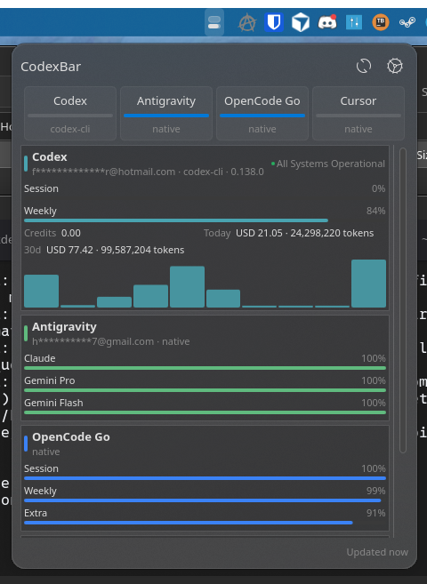

# codexbar-plasmoid



This repository adds a Plasma 6 widget for the CodexBar CLI in `./codexbar`.
The plasmoid shells out to the existing CLI instead of duplicating provider logic, then renders usage limits,
credits, status, local token costs, and recent history with native Plasma/Kirigami controls.

## Install

Build or install the CodexBar CLI first, then make sure `codexbar` is on `PATH`.

```sh
./scripts/install-plasmoid.sh
```

For local preview without installing:

```sh
./scripts/run-windowed.sh
```

## Automatic CLI Updates

The widget can download and keep the CodexBar CLI up to date from the upstream
[steipete/CodexBar](https://github.com/steipete/CodexBar) GitHub releases.
Enable **Auto-download from GitHub** in the widget settings. When enabled, the
helper installs a managed binary at:

```text
~/.local/share/codexbar-plasmoid/bin/codexbar
```

and checks for a newer release before each refresh. Updates are atomic: the new
tarball is downloaded, its SHA-256 checksum is verified, the binary is tested
with `--version`, and only then is the managed copy replaced. If the download
or test fails, the previous managed binary is preserved.

On Linux the updater prefers the statically-linked musl release asset
(`linux-musl-x86_64` / `linux-musl-aarch64`), which runs on NixOS and other
non-FHS systems without `libcurl`, `libstdc++`, or `libsqlite3` at runtime. It
falls back to the glibc asset only for releases that do not ship a musl build;
in that case a non-FHS host needs `nix-ld` (NixOS) or those libraries present,
or you can install a compatible CodexBar CLI yourself and point the CLI path at
it.

You can also check or trigger an update manually from the widget's full view
using the CLI update status row at the bottom.

The updater installs the release asset for the current platform and
architecture (`linux-musl-x86_64`, `linux-musl-aarch64`, `macos-x86_64`,
`macos-arm64`) together with its `VERSION` file, which the CLI reads to report
its version. Leave the **CLI executable** setting as `codexbar` to use the
managed binary when auto-update is enabled, or set an absolute path to use your
own installation.

## Configure

Open the widget configuration from Plasma and adjust:

- CLI path
- enabled providers and each provider's source, account, and all-accounts mode
- refresh interval and CLI timeout
- status, credits, cost, and history visibility
- compact representation metric

The default Linux provider set is Codex through the CLI source and Gemini through the API source. More providers can be
added from the widget settings. Source selection is stored per provider because the CodexBar CLI does not support every
source for every provider, and some web-backed sources are macOS-only.

Provider rows are saved as a JSON list in the `providerConfigs` Plasma setting. Each row contains:

```json
{
  "provider": "codex",
  "source": "cli",
  "enabled": true,
  "account": "",
  "accountIndex": 0,
  "allAccounts": false
}
```

`source` can be `auto`, `cli`, `oauth`, `api`, `web`, or `native`, depending on the provider. On Linux, `auto` maps
native-capable providers to the bundled native fetcher where appropriate: Antigravity, Cursor, Devin, OpenCode, and OpenCode Go
use `native`; Codex, Claude, Augment, Factory, JetBrains, Kiro, Windsurf, and similar local-agent providers use `cli`;
API providers such as Gemini, OpenAI, Groq, DeepSeek, and OpenRouter use `api`; Vertex AI uses `oauth`;
Manus, Amp, T3 Chat, and similar browser-session providers use `web`.

The account fields map to the CodexBar CLI account flags:

- `account`: passes `--account <value>`
- `accountIndex`: passes `--account-index <n>` when `account` is empty and the index is greater than `0`
- `allAccounts`: passes `--all-accounts`

The refresh interval is clamped to 30 seconds through 24 hours. The request timeout is clamped to 5 through 300 seconds.
Compact mode can show either the provider icon or usage bars; usage bars can represent the default provider, the selected
provider, or all providers, and can be tinted by provider color, remaining-limit threshold, or theme text color.

Email addresses are anonymized by default before the helper returns data to QML. Disable **Anonymize emails** only if the
widget may display full account addresses.

### Environment Variables on Linux (esp. NixOS)

The plasmoid process inherits the user's session environment from `systemd --user`, which only sources
`$XDG_CONFIG_HOME/environment.d/*.conf`. Variables exported from `~/.zshrc`, `~/.bashrc`, or a nix profile are
**not** available to spawned children, so the upstream CodexBar CLI sees no API keys and the bundled native
binary cannot find `lsof` even when both exist on the shell's `PATH`.

Two opt-in sources are loaded by the helper **before** it spawns the upstream CLI or the native binary:

1. `$XDG_CONFIG_HOME/environment.d/*.conf` (default `~/.config/environment.d/*.conf`) — systemd-style `KEY=VAL` files,
   loaded in lexical order so later files override earlier ones. This is the right place to put `DEEPSEEK_API_KEY`,
   `OPENROUTER_API_KEY`, `NIX_LD_LIBRARY_PATH`, `PATH`, and any other env var the widget should see.
2. `~/.codexbar/.env` — a plasmoid-local dotenv. Its values win over `environment.d` (matching systemd's later-wins
   semantics), so it is a convenient place to override a system-wide key for this widget without touching the global
   env. The format is the same `KEY=VAL` per line; `#` comments and `export FOO=bar` prefixes are accepted, and
   surrounding single or double quotes are stripped.

Values that are already set in the plasmoid process's `process.env` (e.g. injected by systemd or Plasma) always
take precedence over anything loaded from disk.

Example NixOS setup that gets Antigravity, DeepSeek, and OpenRouter working without touching shell rc files:

```ini
# ~/.config/environment.d/codexbar.conf
PATH=/run/current-system/sw/bin:/etc/profiles/per-user/<user>/bin:/home/<user>/.nix-profile/bin:/run/wrappers/bin
NIX_LD_LIBRARY_PATH=/run/current-system/sw/share/nix-ld/lib
DEEPSEEK_API_KEY=sk-...
OPENROUTER_API_KEY=sk-or-v1-...
DEVIN_BEARER_TOKEN=devin-token...
DEVIN_ORGANIZATION=org_slug
```

Then log out and back in (or `systemctl --user import-environment`) so `systemd --user` picks up the new file.
The widget does not modify `PATH` or `NIX_LD_LIBRARY_PATH` itself — set them where the rest of your environment
lives.

### API Key Configuration

For providers that use the `api` source, the helper can inject API keys from either:

- Directly within the widget's settings for that provider
- `~/.codexbar/config.json`

The inline widget settings configuration wins when both exist. When using `~/.codexbar/config.json`, use a provider-keyed object:

```json
{
  "providers": {
    "gemini": { "apiKey": "..." },
    "openai": { "apiKey": "..." },
    "openrouter": { "apiKey": "..." }
  }
}
```

The helper converts `apiKey` into the environment variable expected by the CodexBar CLI when that variable is not already
set. Supported mappings include `GEMINI_API_KEY`, `OPENAI_API_KEY`, `OPENROUTER_API_KEY`, `GROQ_API_KEY`,
`DEEPSEEK_API_KEY`, `DOUBAO_API_KEY`, `MINIMAX_API_KEY`, `MOONSHOT_API_KEY`, `KILO_API_KEY`, `LLMPROXY_API_KEY`,
`SYNTHETIC_API_KEY`, `VENICE_API_KEY`, `ZAI_API_KEY`, `AZURE_OPENAI_API_KEY`, `ALIBABA_API_KEY`, `GITHUB_TOKEN` for
Copilot, and `DEVIN_BEARER_TOKEN` for Devin (manual token auth; pair with `DEVIN_ORGANIZATION`).

The Plasma package ID is `org.slopfire.codexbar-plasmoid`.

## CLI Contract

The widget uses:

```sh
codexbar usage --format json --json-only --provider <provider> --source <source>
codexbar cost --format json --json-only --provider <provider>
```

Provider status, credits, account selection, email anonymization, and local cost history are controlled through the
plasmoid settings and mapped to the corresponding CodexBar CLI flags. The helper calls `codexbar usage` once per
configured provider so each provider can use its own source mode. Cost lookup is best effort: a cost failure is displayed
as `costError` but does not discard successful usage data.

## Native Linux CLI

Antigravity, Cursor, Devin, OpenCode, and OpenCode Go need Linux-specific handling. This repository ships a Rust binary,
`codexbar-plasmoid`, bundled inside the plasmoid at `plasmoid/contents/code/codexbar-plasmoid`. It reads browser cookies
or `~/.codexbar/config.json` manual cookie headers and calls provider APIs directly where possible. Antigravity uses a
local HTTPS probe against a running `agy` or Antigravity IDE language server. Devin calls the
`app.devin.ai/api/<org>/billing/quota/usage` endpoint with a Bearer token.

Build and bundle it:

```sh
./scripts/build-native-cli.sh
```

`./scripts/install-plasmoid.sh` and `./scripts/run-windowed.sh` build the binary automatically before installing or
previewing the widget.

Run it directly:

```sh
plasmoid/contents/code/codexbar-plasmoid usage --format json --json-only --provider cursor --source native
```

In widget settings, choose **Native** as the source for Antigravity, Cursor, Devin, OpenCode, or OpenCode Go. Linux auto mode
already prefers Native for those providers.

Authentication options:

- Antigravity: a running `agy` process or Antigravity IDE language server
- `~/.codexbar/config.json` provider `cookie_header`
- `CODEXBAR_PLASMOID_CURSOR_COOKIE`, `CODEXBAR_PLASMOID_OPENCODE_COOKIE`, or `CODEXBAR_PLASMOID_OPENCODEGO_COOKIE` (or older `SPLAZMA_*` fallback)
- Chrome/Chromium/Helium/Firefox/Zen cookie import (`secret-tool` required for encrypted Chromium cookies)
- OpenCode Go local usage from `~/.local/share/opencode/opencode.db` when web cookies are unavailable
- Devin: `DEVIN_BEARER_TOKEN` (or `DEVIN_AUTHORIZATION`) env var, or `~/.codexbar/config.json` provider `cookie_header`; pair with `DEVIN_ORGANIZATION` (or `DEVIN_ORG`) for the org slug, internal `org_...` ID, or full `app.devin.ai/org/<slug>` URL

Native cookie configuration uses a provider list:

```json
{
  "providers": [
    {
      "id": "opencode",
      "cookie_header": "auth=...",
      "workspace_id": "wrk_..."
    },
    {
      "id": "cursor",
      "cookie_header": "WorkosCursorSessionToken=..."
    },
    {
      "id": "devin",
      "cookie_header": "eyJhbGci...",
      "workspace_id": "org/my-team"
    }
  ]
}
```

Set `CODEXBAR_CONFIG=/path/to/config.json` to use a different native-fetcher config file. For OpenCode and OpenCode Go,
`workspace_id` can also come from `CODEXBAR_OPENCODE_WORKSPACE_ID` or `CODEXBAR_OPENCODEGO_WORKSPACE_ID`; the value may
be a raw `wrk_...` id or a URL containing one. For Devin, `workspace_id` holds the organization slug, internal `org_...` ID,
or full `app.devin.ai/org/<slug>` URL; it can also come from `DEVIN_ORGANIZATION` or `DEVIN_ORG`.

Successful Antigravity native fetches are cached under the user cache directory. If Antigravity is not running later, the
widget shows the last fetched Antigravity usage with a status note instead of replacing it with an error-only card.
